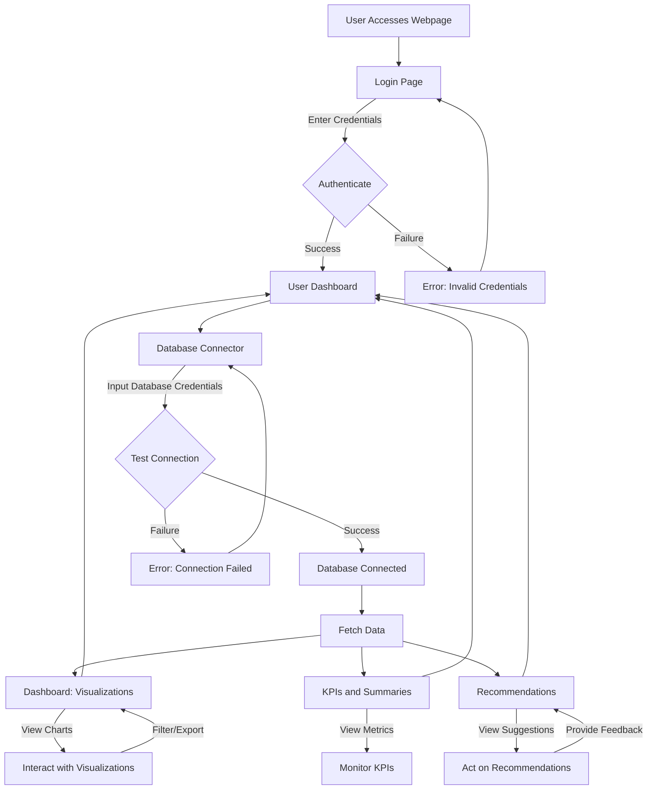

1. Webpage
Description: The webpage serves as the primary interface for your application, hosting all functionalities (login, database connector, dashboard, etc.) in a user-friendly, responsive, and secure environment.

Key Features:

User Interface (UI): A clean, intuitive design with navigation menus for accessing login, dashboard, and other features. Use frameworks like React, Vue.js, or Angular for dynamic rendering.
Responsive Design: Ensure compatibility across devices (desktop, tablet, mobile) using CSS frameworks like Bootstrap or Tailwind CSS.
Landing Page: A homepage introducing the application’s purpose, with a call-to-action for signing up or logging in.
Security: Implement HTTPS for secure data transmission and protect against common vulnerabilities (e.g., XSS, CSRF) using tools like OWASP guidelines.
Performance: Optimize load times with techniques like lazy loading, minified assets, and a Content Delivery Network (CDN).
Accessibility: Follow WCAG guidelines (e.g., alt text for images, keyboard navigation) to ensure inclusivity.
Tech Stack:

Frontend: HTML, CSS, JavaScript (React/Vue.js)
Backend: Node.js with Express, Django, or Flask
Hosting: AWS, Google Cloud, or Vercel
Considerations:

Ensure scalability to handle multiple users.
Use a consistent theme and branding for a professional look.
Include a footer with contact info, terms of service, and privacy policy.
2. Login
Description: The login system authenticates users, ensuring secure access to their personalized dashboards and connected databases.

Key Features:

Authentication: Support email/password login with secure password hashing (e.g., bcrypt). Optionally, integrate OAuth for single sign-on (SSO) with Google, Microsoft, or GitHub.
User Registration: Allow users to sign up with email verification to prevent spam accounts.
Session Management: Use JSON Web Tokens (JWT) or session-based authentication to manage user sessions securely.
Password Recovery: Provide a “forgot password” feature with email-based reset links.
Multi-Factor Authentication (MFA): Optional MFA (e.g., via SMS or authenticator apps) for enhanced security.
Role-Based Access: Support different user roles (e.g., admin, standard user) to restrict access to certain features.
Tech Stack:

Authentication: Firebase Auth, Auth0, or custom implementation with Passport.js
Database: Store user credentials in a secure database (e.g., PostgreSQL, MongoDB)
Security: Rate limiting (to prevent brute-force attacks), CAPTCHA for sign-up/login
Considerations:

Comply with data privacy regulations like GDPR or CCPA for user data.
Provide clear error messages for failed logins (e.g., “Invalid credentials”).
Log login attempts for security monitoring.
3. Database Connector
Description: The database connector allows users to securely connect their databases to the application, enabling data retrieval for visualizations, KPIs, and recommendations.

Key Features:

Supported Databases: Support popular databases like MySQL, PostgreSQL, MongoDB, SQL Server, and cloud-based solutions (e.g., Amazon RDS, Google BigQuery).
Connection Interface: A form where users input database credentials (host, port, username, password, database name). Use encrypted connections (e.g., TLS/SSL).
Credential Storage: Store credentials securely using encryption (e.g., AWS Secrets Manager, HashiCorp Vault) and never expose them in logs or responses.
Connection Testing: Allow users to test the connection before saving, with clear success/failure feedback.
Data Schema Preview: Display a preview of the database schema (tables, columns) to help users select relevant data.
Query Execution: Allow safe, parameterized queries to fetch data, preventing SQL injection. Optionally, provide a query builder for non-technical users.
Tech Stack:

Database Drivers: Knex.js (Node.js), SQLAlchemy (Python), or TypeORM
Security: Encryption libraries, secure connection protocols
Backend: API endpoints to handle connection setup and data retrieval
Considerations:

Limit the scope of database access to read-only for security.
Handle connection errors gracefully (e.g., timeouts, invalid credentials).
Support connection pooling for efficient resource use with multiple users.
4. Dashboard with Basic Visualizations
Description: The dashboard is a centralized interface displaying visualizations of the user’s connected database data, enabling quick insights.

Key Features:

Visualization Types: Include basic charts like:
Bar charts (e.g., sales by region)
Line charts (e.g., trends over time)
Pie charts (e.g., category distribution)
Tables (for raw data)
Chart Customization: Allow users to select data fields, filter data (e.g., by date range), and choose chart types.
Interactive Elements: Support hover tooltips, zoom, and click-to-drill-down for deeper insights.
Data Refresh: Enable manual or scheduled data refreshes from the connected database.
Layout: Provide a grid-based layout where users can drag-and-drop or resize visualization widgets.
Export Options: Allow users to export charts as PNG, PDF, or CSV.
Tech Stack:

Visualization Libraries: Chart.js, D3.js, or ApexCharts
Frontend Framework: React/Vue.js for dynamic rendering
Backend: API to fetch and aggregate data for visualizations

5. KPI and Summary
Description: KPIs (Key Performance Indicators) and summaries provide concise metrics and insights derived from the user’s data, highlighting critical business performance.

Key Features:

KPIs: Display key metrics like total revenue, customer retention rate, or inventory turnover. Use cards or widgets with bold numbers and trends (e.g., “+10% vs last month”).
Summary: Generate textual or bullet-point summaries of data trends, e.g., “Sales increased by 15% in Q2, driven by product X.”
Custom KPIs: Allow users to define custom KPIs based on their data (e.g., average order value = total revenue ÷ number of orders).
Time-Based Analysis: Show KPIs for different time periods (daily, weekly, monthly) with comparison options.
Alerts: Notify users when KPIs cross thresholds (e.g., “Revenue dropped below $10,000”).
Tech Stack:

Backend: SQL queries or Python (Pandas) for KPI calculations
Frontend: React/Vue.js for KPI cards
NLP (for summaries): Basic text generation or integrate with AI models (e.g., via xAI’s API)
Example KPI Card:

Metric: Total Revenue
Value: $50,000
Trend: +12% (vs last month)
Visual: Small sparkline showing monthly trend
Considerations:

Ensure KPI calculations are accurate and transparent (e.g., show formulas).
Optimize for real-time or near-real-time updates.
Use color coding (green for positive, red for negative) for quick interpretation.
6. Recommendations
Description: Recommendations provide actionable insights based on data analysis, helping users optimize their business processes or strategies.

Key Features:

Data-Driven Insights: Analyze data to suggest actions, e.g., “Increase stock for product X due to high demand” or “Target region Y for marketing due to low penetration.”
Machine Learning: Use simple ML models (e.g., clustering, regression) to identify patterns, like customer segments or sales forecasts.
Personalization: Tailor recommendations based on user data and goals (e.g., cost reduction, revenue growth).
Presentation: Display recommendations as a prioritized list with explanations (e.g., “Why: Sales of X spiked 20% last month”).
Feedback Loop: Allow users to rate or dismiss recommendations to improve future suggestions.
Tech Stack:

Analysis: Python (scikit-learn, Pandas) or R for ML models
Backend: API to serve recommendations
AI Integration: Optionally use xAI’s API (https://x.ai/api) for advanced analytics
Frontend: Display recommendations in a dedicated dashboard section
Example Recommendation:

Action: “Run a discount campaign for product Z.”
Reason: “Low sales in Q2 despite high website traffic.”
Expected Impact: “+10% sales based on historical discount campaigns.”
Considerations:

Start with rule-based recommendations (e.g., “If sales drop >10%, suggest promotion”) before adding ML.
Ensure recommendations are specific, measurable, and actionable.
Handle sensitive data carefully to avoid privacy issues.
General Considerations for the Application
Scalability: Design the backend to handle multiple users and large datasets (e.g., use database indexing, caching with Redis).
Security: Implement end-to-end encryption, sanitize inputs, and regularly audit for vulnerabilities.
User Experience: Conduct user testing to refine the UI/UX, ensuring non-technical users can navigate easily.
Documentation: Provide user guides or tooltips for connecting databases, creating visualizations, and interpreting KPIs/recommendations.
Compliance: Adhere to data protection laws (e.g., GDPR for EU users) and industry standards for database access.
Next Steps
Define Scope: Prioritize features (e.g., start with MySQL support, basic charts, and rule-based recommendations).
Prototype: Build a minimum viable product (MVP) with login, database connector, and simple dashboard.
Test: Validate with a small user group to gather feedback on usability and performance.
Iterate: Add advanced features (e.g., ML recommendations, MFA) based on user needs.

Detailed Explanation of the Workflow Diagram
Below is a step-by-step breakdown of the workflow diagram, describing each node, decision point, and transition. This complements the textual diagram and provides context for each component.

**User Accesses Webpage (A):**

Description: The user navigates to the application's homepage (e.g., via a browser URL like https://yourapp.com).

Details: The webpage displays a landing page with a login button or sign-up option. It may include a brief introduction to the app's features (e.g., "Connect your database, visualize data, get insights").

Transition: User clicks "Login" to proceed to the login page.

**Login Page (B):**

Description: The user is presented with a login form to enter credentials (email/password or SSO options like Google).

Details: The form includes fields for username/email, password, and optional MFA. A "Forgot Password" link and sign-up option are available.

Transition: User submits credentials, leading to authentication.

**Authenticate (C):**

Description: The system verifies the user's credentials against stored data (e.g., in a secure database).

Details: Uses secure protocols (e.g., bcrypt for password verification, JWT for session management). If MFA is enabled, an additional verification step occurs.

Decision Point:

Success: User is authenticated and redirected to the user dashboard.

Failure: User sees an error message ("Invalid credentials") and returns to the login page.

**User Dashboard (D):**

Description: A personalized dashboard where users access all features (database connector, visualizations, KPIs, recommendations).

Details: Displays a navigation menu and widgets for connected databases, recent visualizations, and key metrics. Acts as a central hub.

Transition: User selects "Connect Database" to proceed to the database connector.

**Database Connector (F):**

Description: A form where users input database credentials (e.g., host, port, username, password).

Details: Supports multiple database types (e.g., MySQL, PostgreSQL). Credentials are encrypted and stored securely. A "Test Connection" button validates the input.

Transition: User submits credentials, leading to connection testing.

**Test Connection (G):**

Description: The system attempts to connect to the database using provided credentials.

Details: Uses secure protocols (e.g., TLS/SSL). Displays schema preview if successful.

**Decision Point:**

Success: Database is connected, and data can be fetched.

Failure: Error message ("Connection failed") prompts the user to retry or correct credentials.

**Database Connected (H):**

Description: The database is successfully linked, enabling data access.

Details: The system stores connection details securely and allows users to select tables/fields for analysis.

Transition: Data is fetched for visualizations, KPIs, and recommendations.

**Fetch Data (J):**

Description: The system retrieves data from the connected database based on user-defined queries or selections.

Details: Uses safe, parameterized queries to prevent SQL injection. Data is aggregated or filtered as needed.

Transition: Data is sent to three parallel components: Visualizations, KPIs/Summaries, and Recommendations.

**Dashboard: Visualizations (K):**

Description: Displays charts (e.g., bar, line, pie) based on fetched data.

Details: Users can customize charts (e.g., select fields, apply filters) and interact (e.g., hover, zoom, export). Example: A line chart showing sales trends.

Transition: Users interact with visualizations (N) and can return to the dashboard to explore other features.

**KPIs and Summaries (L):**

Description: Shows key metrics (e.g., total revenue) and textual summaries (e.g., “Sales up 15% in Q2”).

Details: KPIs are displayed as cards with trends; summaries are concise and data-driven. Users can define custom KPIs.

Transition: Users monitor KPIs (O) and return to the dashboard.

**Recommendations (M):**

Description: Provides actionable suggestions based on data analysis (e.g., “Increase stock for product X”).

Details: Uses rule-based or ML-driven logic. Recommendations are prioritized and include explanations. Users can provide feedback to refine suggestions.

Transition: Users act on recommendations (P) and return to the dashboard.

**Return to Dashboard:**

Description: After interacting with visualizations, KPIs, or recommendations, users return to the dashboard to continue exploring or perform other actions (e.g., connect another database).